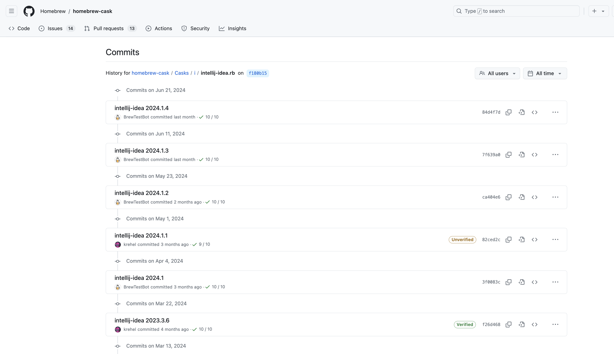
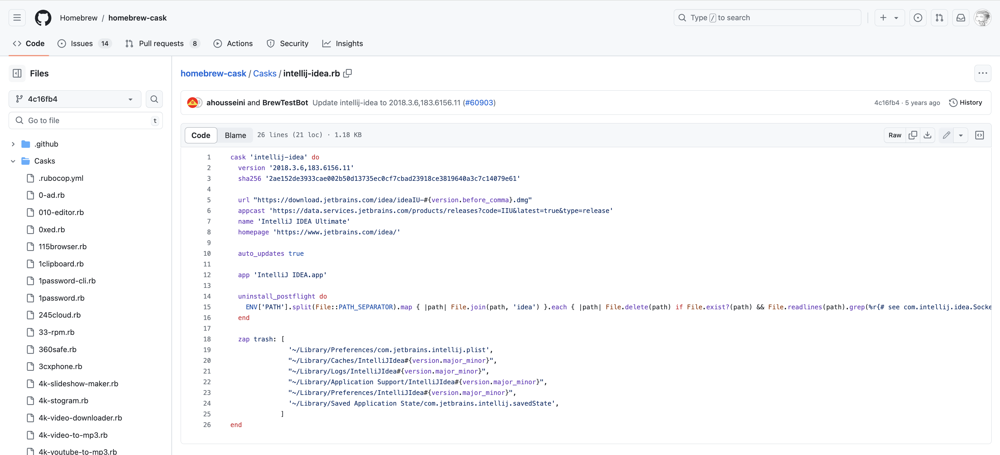

# How to install a software of old version
Take Intellij Idea as an example
## Show the source information
```sh
brew info intellij-idea 
==> intellij-idea: 2024.1.4,241.18034.62 (auto_updates)
https://www.jetbrains.com/idea/
Installed
/opt/homebrew/Caskroom/intellij-idea/2018.3.6,183.6156.11 (127B)
From: https://github.com/Homebrew/homebrew-cask/blob/HEAD/Casks/i/intellij-idea.rb
==> Name
IntelliJ IDEA Ultimate
==> Description
Java IDE by JetBrains
==> Artifacts
IntelliJ IDEA.app (App)
/Applications/IntelliJ IDEA.app/Contents/MacOS/idea (Binary)
==> Analytics
install: 2,431 (30 days), 8,381 (90 days), 34,764 (365 days)
```

## Go to GitHub to search the history commits
Base on the From: github information then go to [commits history page](https://github.com/Homebrew/homebrew-cask/commits/f180b154f0e9f2890fb12563843dfafd104971ba/Casks/i/intellij-idea.rb) and find the old version you want.


## Download the rb file
Download the v2018 [rb file](https://github.com/Homebrew/homebrew-cask/blob/4c16fb4761ce8e96fc30f3f7ef100a3e9c86d907/Casks/intellij-idea.rb)


## Brew install by rb file
```sh
brew install intellij-idea.rb 
==> Downloading https://formulae.brew.sh/api/formula.jws.json
####################################################################################################################################################################################################################################### 100.0%
Error: Unexpected method 'appcast' called on Cask intellij-idea.
Follow the instructions here:
  https://github.com/Homebrew/homebrew-cask#reporting-bugs
Error: Failed to load formula: intellij-idea.rb
intellij-idea: undefined method `cask' for module Formulary::FormulaNamespace9134b35fa4ba8067d1150c36abdbe089dcaa8b7fd7ca86d52a450f021039ce32
Warning: Treating intellij-idea.rb as a cask.
==> Downloading https://download.jetbrains.com/idea/ideaIU-2018.3.6.dmg
==> Downloading from https://download-cdn.jetbrains.com/idea/ideaIU-2018.3.6.dmg
####################################################################################################################################################################################################################################### 100.0%
==> Installing Cask intellij-idea
Error: Unexpected method 'appcast' called on Cask intellij-idea.
Follow the instructions here:
  https://github.com/Homebrew/homebrew-cask#reporting-bugs
==> Moving App 'IntelliJ IDEA.app' to '/Applications/IntelliJ IDEA.app'
🍺  intellij-idea was successfully installed!
```
# Ref
`https://juejin.cn/post/7179202980191666233`